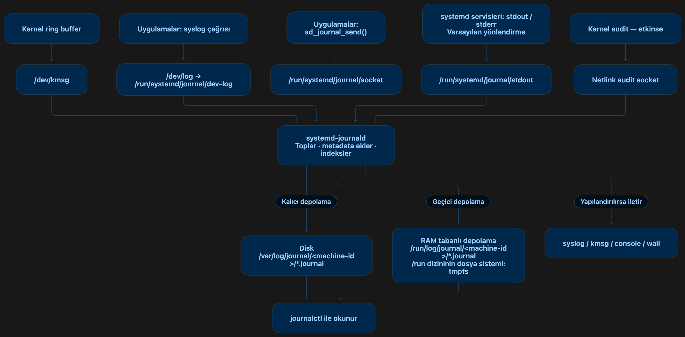
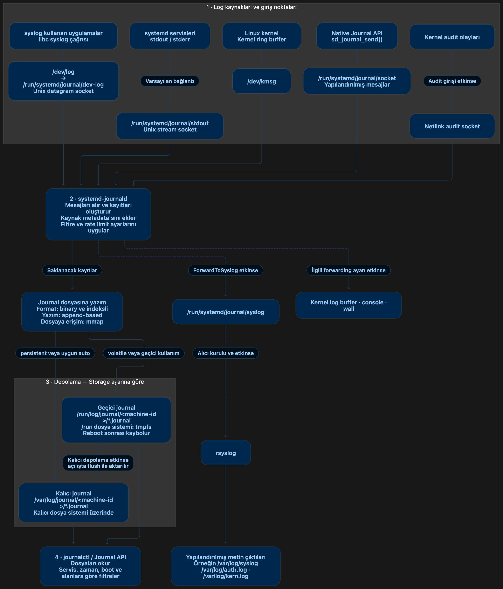
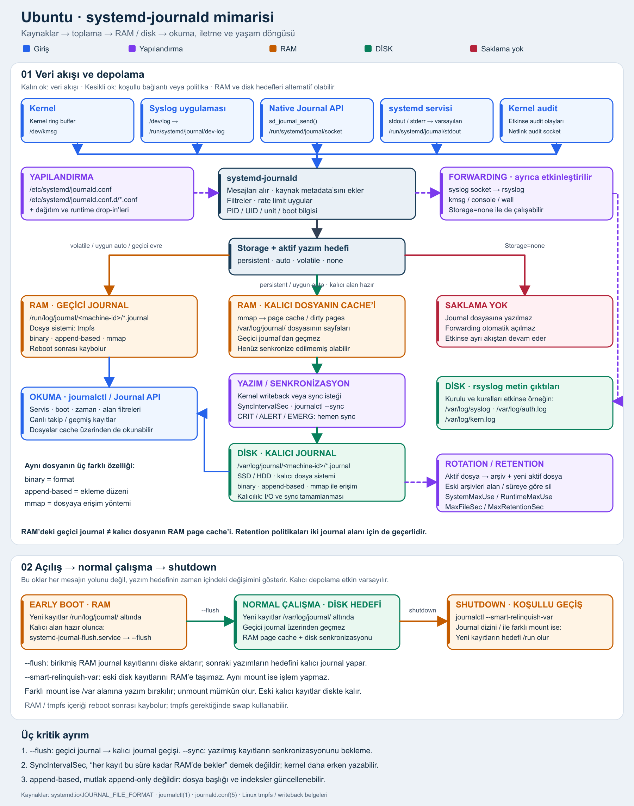

<div align="right">

**English** | [Türkçe](README.tr.md)

</div>

# Linux Sysadmin Lab

A hands-on Linux system administration lab: systemd, users & groups, apt, logging, processes, SSH and networking — learning how a Linux system actually works by poking at it, not by reading about it.

All experiments run on a real **Ubuntu** machine, and the outputs shown are real, not idealized.

The longer-term goal behind this lab is virtualization and Kubernetes. Almost every chapter here is a building block for that world: systemd runs the kubelet, users and permissions become security contexts, veth pairs and bridges are how pods talk to each other. This lab is the Linux underneath Kubernetes.

## Table of contents

- [Part 0 — Linux filesystem layout](#part-0--linux-filesystem-layout)
- [Part 1 — Everything is a file](#part-1--everything-is-a-file)
- [Part 2 — systemd & systemctl](#part-2--systemd--systemctl)
- [Part 3 — Logging & journalctl](#part-3--logging--journalctl)
- [Part 4 — Users & groups](#part-4--users--groups)
- [Part 5 — Package management (apt)](#part-5--package-management-apt)
- [Part 6 — Process management](#part-6--process-management)
- [Part 7 — SSH & sshd](#part-7--ssh--sshd)
- [Part 8 — Networking basics](#part-8--networking-basics)
- [Part 9 — File permissions & ownership](#part-9--file-permissions--ownership)
- [Part 10 — Disk & filesystem](#part-10--disk--filesystem)
- [Part 11 — Cron & timers](#part-11--cron--timers)

## Curriculum

| # | Part | Question it answers | Status |
|---|------|--------------------|--------|
| 0 | [Linux filesystem layout](#part-0--linux-filesystem-layout) | What lives where in the directory tree — what are /etc, /var, /usr, /bin for? | ✅ |
| 1 | [Everything is a file](#part-1--everything-is-a-file) | What is a file, a file descriptor, a socket — and why is *everything* one? | ⏳ |
| 2 | [systemd & systemctl](#part-2--systemd--systemctl) | How does systemd control every program on the machine? | ✅ |
| 3 | [Logging & journalctl](#part-3--logging--journalctl) | Where do logs live, and how do I interrogate the journal? | ✅ |
| 4 | [Users & groups](#part-4--users--groups) | How do I create, restrict and destroy users — and what is a group really? | ✅ |
| 5 | [Process management](#part-5--process-management) | What is a process, a signal — and what really separates SIGTERM from SIGKILL? | 🔜 |
| 6 | [Package management (apt)](#part-6--package-management-apt) | What actually happens on `apt install` — repos, GPG keys, binaries? | 🔜 |
| 7 | [SSH & sshd](#part-7--ssh--sshd) | How do I set up and harden sshd, and manage keys properly? | 🔜 |
| 8 | [Networking basics](#part-8--networking-basics) | How does the machine talk — interfaces, DNS, firewall, namespaces? | 🔜 |
| 9 | [File permissions & ownership](#part-9--file-permissions--ownership) | Who may touch what — chmod, umask, setuid, ACL? | 🔜 |
| 10 | [Disk & filesystem](#part-10--disk--filesystem) | How do disks become directories — mount, fstab, LVM? | 🔜 |
| 11 | [Cron & timers](#part-11--cron--timers) | How do I run things on a schedule — and cron vs systemd timers? | 🔜 |
| 12 | [Memory & I/O](#part-12--memory--io) | How is memory managed — what do page cache, dirty pages, writeback, fsync actually do? | 🔜 |

---

# Part 0 — Linux filesystem layout

Machine: Ubuntu 24.04 (AWS). This part isn't lab practice, it's a standard FHS (Filesystem Hierarchy Standard) reference.

## Cheat sheet

| Directory | Holds | Persistent | Written by |
|-----------|-------|------------|------------|
| `/etc` | system-wide config files (text) | persistent | root, packages at install time |
| `/var` | data that changes: logs, cache, spool, databases | persistent | services, root |
| `/usr` | installed programs + libraries + shared data | persistent, apt-managed | package manager (apt) |
| `/bin` | core commands (`ls`, `cat`...) — symlink to `/usr/bin` on Ubuntu | persistent | package manager |
| `/home` | users' personal files | persistent | the user themself |
| `/tmp` | short-lived temporary files | cleaned periodically (`systemd-tmpfiles`), tmpfs or disk depending on the distro (on this machine: disk — see 0.4) | everyone (world-writable, sticky bit) |
| `/opt` | non-apt, self-contained 3rd-party software | persistent | manual installs |
| `/proc` | running processes + kernel state — not a real file, a live view of the kernel | in RAM, not on disk | kernel |
| `/sys` | virtual fs where the kernel exports device/driver info | in RAM, not on disk | kernel |
| `/dev` | device nodes (`/dev/sda`, `/dev/null`, `/dev/tty1`...) | in RAM (devtmpfs), not on disk | kernel (udev) |
| `/lib` | kernel modules + shared libraries for core programs — symlink to `/usr/lib` on Ubuntu | persistent | package manager |

## 0.1 — Directory tree (overview)

```
/
|-- bin -> usr/bin              # symlink (usrmerge)
|-- sbin -> usr/sbin             # symlink (usrmerge)
|-- lib -> usr/lib               # symlink (usrmerge)
|-- etc/                         # system-wide config, text
|-- usr/                         # apt-managed: programs, libraries, shared data
|-- var/                         # persistent, changing data
|   |-- log/                     # log files
|   |-- lib/                     # service state/data (persistent)
|   `-- tmp/                     # temp files kept longer than /tmp, always on disk
|-- tmp/                         # short-lived temp files (on this machine: disk, not tmpfs -- see 0.4)
|-- opt/                         # non-apt, 3rd-party software
|-- home/                        # user home directories
|-- root/                        # root user's home, separate from /home
|-- proc/                        # virtual, kernel process view -- not on disk
|-- sys/                         # virtual, kernel device/driver view -- not on disk
|-- dev/                         # device nodes (devtmpfs) -- not on disk
`-- run/                         # tmpfs, runtime data -- recreated from scratch on every boot
```

## 0.2 — Why `/bin` and `/lib` are symlinks

Ubuntu adopted "usrmerge": `/bin`, `/sbin`, `/lib` used to be separate directories at the root, because early boot might happen before `/usr` was mounted. Now that the initramfs mounts everything early, the split became pointless — everything moved under `/usr`, and the old names stayed as symlinks for backward compatibility.

```
$ ls -la /
lrwxrwxrwx ... bin -> usr/bin
lrwxrwxrwx ... lib -> usr/lib
lrwxrwxrwx ... sbin -> usr/sbin
```

| Path | Real location |
|------|----------------|
| `/bin/ls` | `/usr/bin/ls` |
| `/sbin/reboot` | `/usr/sbin/reboot` |
| `/lib/systemd` | `/usr/lib/systemd` |

## 0.3 — `/proc`, `/sys`, `/dev`: not on disk

All three are **virtual** filesystems. They show up in `df -h` but use no disk space; the kernel recreates them from scratch on every reboot.

| Directory | Shows | Example |
|-----------|-------|---------|
| `/proc/<pid>/` | state of that process | `/proc/1/status`, `/proc/1/cmdline` |
| `/proc/cpuinfo`, `/proc/meminfo` | kernel's view of hardware/resources | `cat /proc/meminfo` |
| `/sys/class/net/` | kernel objects for network interfaces | `/sys/class/net/eth0` |
| `/dev/sda`, `/dev/null`, `/dev/tty1` | device node — writing to it means talking to hardware | `echo hi > /dev/null` |

## 0.4 — `/tmp` vs `/var/tmp` vs `/opt`

| Directory | Lifetime | Use |
|-----------|----------|-----|
| `/tmp` | short — periodically swept by `systemd-tmpfiles` | short-lived temp files |
| `/var/tmp` | kept longer than `/tmp`, always on disk | temp files for long-running jobs |
| `/opt` | persistent, not managed by apt | 3rd-party software that ships as a single self-contained package (e.g. `/opt/google/chrome`) |

**Verified on this machine: `/tmp` is disk, not tmpfs.**

```
$ mount | grep " /tmp "
(empty -- no match, not a separate mount point)
$ df -h /tmp
Filesystem      Size  Used Avail Use% Mounted on
/dev/root        19G  2.6G   16G  15% /
$ systemctl cat tmp.mount
No files found for tmp.mount.
```

On Ubuntu 24.04, systemd's `tmp.mount` unit is shipped by the package to `/usr/share/systemd/tmp.mount`, not `/usr/lib/systemd/system/` — meaning the unit is never even "installed" (not disabled, just absent). With no `/tmp` entry in `/etc/fstab` either, `/tmp` stays a plain directory under `/` (root filesystem, disk). This isn't specific to the cloud image, it's Ubuntu 24.04's general default (Debian 13/trixie switched it to tmpfs, Ubuntu 24.04 did not). `systemd-tmpfiles` has nothing to do with this — it only cleans up old files inside `/tmp` (older than 10 days on 24.04), it has no bearing on the mount itself.

Sources:
- https://packages.ubuntu.com/noble/amd64/systemd/filelist
- https://www.debian.org/releases/trixie/release-notes/issues.en.html
- https://github.com/systemd/systemd/blob/main/units/tmp.mount

## Notes

- Almost everything under `/etc` is text config, not binary — not a hard rule, just the near-universal convention.
- `/usr` is apt-managed territory: everything you `apt install` lands here, hands off otherwise.
- Service accounts' home is usually `/nonexistent` or `/var/lib/<service>`, not under `/home` (see Part 4).

[↑ Go back to TOC](#table-of-contents)

---

# Part 1 — Everything is a file

> ⏳ Placeholder — files, inodes, file descriptors, special files (device, pipe, socket), `lsof`, `/proc/PID/fd`.

[↑ Go back to TOC](#table-of-contents)

---

# Part 2 — systemd & systemctl

Machine: Ubuntu 24.04 (AWS), account `ubuntu` (sudo).

## Cheat sheet

| Command | What it does |
|---|---|
| `ps -p 1 -o pid,comm` | show who PID 1 is (systemd) |
| `ps -ef --forest` | draw the process tree with indentation, show parent/child relationships |
| `ps -p <pid> -o pid,ppid` | show a process's parent PID |
| `systemctl status <service>` | show status |
| `sudo systemctl start <service>` | start now |
| `sudo systemctl stop <service>` | stop now |
| `sudo systemctl restart <service>` | stop + start |
| `sudo systemctl reload <service>` | re-read config without killing the process (services that support it) |
| `sudo systemctl enable <service>` | start automatically at boot (creates a symlink) |
| `sudo systemctl disable <service>` | don't start at boot (removes the symlink) |
| `journalctl -u <service> -n N` | last N log lines |
| `journalctl -u <service> -f` | follow the log live |
| `journalctl -u <service> -p err` | only error+ severity logs |
| `ls -la /etc/systemd/system/` | units the admin added/enabled by hand, and symlinks |
| `sudo systemctl daemon-reload` | tell systemd about a change to an existing unit file |
| `systemctl show <unit> -p <Prop>` | show the final/effective value of a single property |
| `systemctl cat <unit>` | show the unit + its drop-ins concatenated |
| `sudo systemctl edit <unit>` | create/edit a drop-in override file (triggers its own daemon-reload) |
| `sudo systemctl mask <unit>` / `unmask` | make even manual `start` impossible / undo that |
| `systemctl is-enabled/is-active/is-failed <unit>` | script-friendly single word + exit code |
| `systemctl list-unit-files` | enable state of every unit |
| `systemctl list-dependencies <unit>` | dependency tree |

## 2.1 — PID 1: systemd

The kernel's first process at boot is systemd; every other process on the system (services, your shell, your SSH connection) is its child, directly or indirectly.

```
$ ps -p 1 -o pid,comm
    PID COMMAND
      1 systemd
```

| Flag | Meaning |
|---|---|
| `-p` | filter by PID |
| `-o pid,comm` | show only PID and process name (command) |

Practical relevance: `systemctl` commands work because you're talking to systemd. `kill -9 1` does NOT crash the machine — the kernel never delivers signals without an installed handler (including SIGKILL) to PID 1; they're silently ignored (source: `man 2 kill`, the "init special case"; `man 7 signal`).

## 2.2 — systemd is a daemon, systemctl is a client

`systemd` (PID 1) is a daemon that runs continuously in the background — starting/stopping services, reading unit files is its actual job. `systemctl` doesn't do the work itself; it sends systemd a "do this" message.

That communication happens over **D-Bus** — a Linux IPC (inter-process communication) system used for processes to talk to each other. `systemctl` sends a D-Bus message; systemd (the listener on D-Bus) receives and processes it. Not just systemd — many Linux services (NetworkManager, the bluetooth stack) use D-Bus too.

## 2.3 — Process tree: parent/child

`ps -ef --forest` draws the output as a tree — indentation and `└─` characters show which process is whose child. systemd (PID 1) sits at the top-left, everything else branches down from there.

| Command | For |
|---|---|
| `ps -ef --forest \| grep sshd` | filter to just the sshd branch |
| `ps -ef --forest \| less` then `/sshd` | interactive search; `n` next match, `q` quit |

```
systemd (PID 1)
 └─ sshd listener (857, root)               — always-running sshd, waiting for connections
     ├─ sshd: ubuntu [priv] (858)            — privilege-separation process for pts/0
     │   └─ sshd: ubuntu@pts/0 (1003)        — first SSH session
     │       └─ -bash (1049)
     └─ sshd: ubuntu [priv] (860)            — pts/1 (the one in use now)
         └─ sshd: ubuntu@pts/1 (1048)
             └─ -bash (1058)
                 ├─ ps -ef --forest (1144)
                 └─ less (1145)
```

Verifying the chain one hop at a time with `ps -p <pid> -o pid,ppid`:

| PID | PPID |
|---|---|
| 1058 | 1048 |
| 1048 | 860 |
| 860 | 857 |
| 857 | 1 |
| 1 | 0 |

PID 1's PPID is 0 — the kernel itself.

## 2.4 — systemd unit directories

| Directory | Priority | Written by |
|---|---|---|
| `/etc/systemd/system/` | high | sysadmin (hand-added/overridden units, symlinks created by `enable`) |
| `/run/systemd/system/` | mid | systemd/programs (runtime-generated temporary units, deleted on reboot) |
| `/usr/lib/systemd/system/` (symlink: `/lib/systemd/system/`) | low | apt/dpkg (default unit files installed by packages) |

| Config/state files | Holds |
|---|---|
| `/etc/systemd/*.conf` (`system.conf`, `journald.conf`, `logind.conf`...) | systemd's own behavior settings |
| `/var/lib/systemd/` | systemd's state files |
| `/var/log/journal/` | where journalctl logs live (if persistent) |

## 2.5 — Inspecting the directory: symlinks

```
$ ls -la /etc/systemd/system/ /lib/systemd/system/ 2>&1 | head -30
/etc/systemd/system/:
lrwxrwxrwx  1 root root   38 Jun 10 10:16 chronyd.service -> /usr/lib/systemd/system/chrony.service
drwxr-xr-x  2 root root 4096 Jun 10 10:10 cloud-config.target.wants
lrwxrwxrwx  1 root root   44 Jun 10 10:11 dbus-org.freedesktop.ModemManager1.service -> /usr/lib/systemd/system/ModemManager.service
lrwxrwxrwx  1 root root   48 Jun 10 10:08 dbus-org.freedesktop.resolve1.service -> /usr/lib/systemd/system/systemd-resolved.service
drwxr-xr-x  2 root root 4096 Sep 20 20:50 multi-user.target.wants
-rw-r--r--  1 root root  359 Jun 10 10:16 snap-amazon\x2dssm\x2dagent-13009.mount
-rw-r--r--  1 root root  591 Sep 20 20:50 snap.amazon-ssm-agent.amazon-ssm-agent.service
```

| Entry type | Example | What it means |
|---|---|---|
| symlink (starts with `l`) | `chronyd.service -> .../chrony.service` | someone ran `systemctl enable chronyd`; `enable` doesn't copy the file, it creates a symlink pointing to the original in `/usr/lib/systemd/system/` |
| `.wants`/`.requires` directory | `multi-user.target.wants/` | "when this target runs, these should run too" list — contents are always symlinks only |
| plain file (starts with `-`) | `snap-core22-2411.mount` | a real unit file, usually auto-generated (snap packages) |

Verification:

```
$ ls -l /etc/systemd/system/chronyd.service
lrwxrwxrwx 1 root root 38 Jun 10 10:16 /etc/systemd/system/chronyd.service -> /usr/lib/systemd/system/chrony.service
$ ls -l /usr/lib/systemd/system/chrony.service
-rw-r--r-- 1 root root 1923 Jul  2  2024 /usr/lib/systemd/system/chrony.service
```

## 2.6 — The `.wants` mechanism and targets

`multi-user.target` = the state where the system has "network up, multi-user capable, no graphical interface" — the normal boot target used on servers.

| Rule | Explanation |
|---|---|
| Contents of `.wants`/`.requires` | always symlinks only, never a real file |
| Which target it's linked to | depends on the `WantedBy=<target>` line in the unit file's `[Install]` section; `enable` drops the symlink into that target's `.wants/` directory |
| Relation to boot | at boot systemd tries to reach a default target (usually `multi-user.target`), and starts every service in that target's `.wants/` directory along the way |

## 2.7 — Unit file anatomy

```
$ cat /lib/systemd/system/cron.service
[Unit]
Description=Regular background program processing daemon
Documentation=man:cron(8)
After=remote-fs.target nss-user-lookup.target

[Service]
EnvironmentFile=-/etc/default/cron
ExecStart=/usr/sbin/cron -f -P $EXTRA_OPTS
IgnoreSIGPIPE=false
KillMode=process
Restart=on-failure
SyslogFacility=cron

[Install]
WantedBy=multi-user.target
```

| Section | Content |
|---|---|
| `[Unit]` | identity and dependencies — `Description=`, `After=`, `Before=`, `Requires=`, `Wants=` |
| `[Service]` | type-specific — `ExecStart=`, `ExecStop=`, `Restart=`, `Type=`, `User=` |
| `[Install]` | what happens on enable, which target to attach to — `WantedBy=`, `RequiredBy=`, `Alias=` |

| Unit type | Represents | Example |
|---|---|---|
| `.service` | a process/daemon | `cron.service`, `nginx.service` |
| `.mount` | a filesystem mount point | `boot-efi.mount` |
| `.socket` | a network/IPC socket — triggers the associated service on connection | `docker.socket` |
| `.timer` | a scheduled task, similar to cron | `apt-daily.timer` |
| `.target` | a synchronization point representing a group of units (not a real process) | `multi-user.target` |

### Case study: writing the `logger-demo` service

| Step | Command |
|---|---|
| write the script | `sudo tee /usr/local/bin/logger-demo.sh > /dev/null << 'EOF' ... EOF` + `sudo chmod +x` |
| write the unit file | `sudo tee /etc/systemd/system/logger-demo.service > /dev/null << 'EOF' ... EOF` |
| check it's loaded | `systemctl status logger-demo` |
| start | `sudo systemctl start logger-demo` |
| check status | `systemctl status logger-demo` |
| start at boot | `sudo systemctl enable logger-demo` |
| watch logs | `journalctl -u logger-demo -n 5` / `-f` |
| stop + disable | `sudo systemctl stop logger-demo` / `sudo systemctl disable logger-demo` |
| reboot test (disabled) | `sudo reboot` → `systemctl status logger-demo` |
| reboot test (enabled) | `sudo systemctl enable logger-demo` → `sudo reboot` → `systemctl status logger-demo` |

Script:
```bash
#!/bin/bash
counter=0
while true; do
  echo "$(date '+%Y-%m-%d %H:%M:%S') - heartbeat #$counter"
  counter=$((counter + 1))
  sleep 5
done
```

Unit:
```ini
[Unit]
Description=Demo heartbeat logger

[Service]
ExecStart=/usr/local/bin/logger-demo.sh
Restart=on-failure

[Install]
WantedBy=multi-user.target
```

Process:

1. The moment the unit file is written to `/etc/systemd/system/`, `systemctl status logger-demo` already recognizes it — but since it hasn't been started, it's `inactive`:
   ```
   ○ logger-demo.service - Demo heartbeat logger
        Loaded: loaded (/etc/systemd/system/logger-demo.service; disabled; preset: enabled)
        Active: inactive (dead)
   ```
2. After `sudo systemctl start logger-demo` it's running, but `Loaded` still says `disabled` — **start and enable are independent steps**, starting a service doesn't mean it'll start at boot:
   ```
   ● logger-demo.service - Demo heartbeat logger
        Loaded: loaded (/etc/systemd/system/logger-demo.service; disabled; preset: enabled)
        Active: active (running) since Mon 2026-09-21 22:00:05 UTC; 9s ago
      Main PID: 1901 (logger-demo.sh)
         Tasks: 2 (limit: 265)
        Memory: 856.0K (peak: 1.1M)
           CPU: 12ms
        CGroup: /system.slice/logger-demo.service
                ├─1901 /bin/bash /usr/local/bin/logger-demo.sh
                └─1907 sleep 5
   ```
   `ls /etc/systemd/system/multi-user.target.wants/ | grep logger` returns **empty** at this point — it hasn't been `enable`d yet.
3. `sudo systemctl enable logger-demo` does two things: `Loaded` now says `enabled`, and a symlink appears in `.wants/`:
   ```
   $ sudo systemctl enable logger-demo
   Created symlink /etc/systemd/system/multi-user.target.wants/logger-demo.service → /etc/systemd/system/logger-demo.service.
   $ ls -la /etc/systemd/system/multi-user.target.wants/logger-demo.service
   lrwxrwxrwx 1 root root 39 Sep 21 22:03 ... -> /etc/systemd/system/logger-demo.service
   ```
4. `journalctl -u logger-demo -n 5` shows the service's logs; `-f` follows live (`^C` to exit):
   ```
   Sep 21 22:05:05 lev-k logger-demo.sh[1901]: 2026-09-21 22:05:05 - heartbeat #60
   Sep 21 22:05:10 lev-k logger-demo.sh[1901]: 2026-09-21 22:05:10 - heartbeat #61
   ```
5. `stop` kills the process with `SIGTERM` (`code=killed, signal=TERM`), `disable` removes the symlink:
   ```
   $ sudo systemctl disable logger-demo
   Removed "/etc/systemd/system/multi-user.target.wants/logger-demo.service".
   ```
6. **Reboot test 1 (disabled):** before `sudo reboot`, `Loaded: disabled` / `Active: inactive`. Same after reboot: still `disabled` / `inactive` — a disabled service doesn't come up on its own at reboot.
7. **Reboot test 2 (enabled):** after `sudo systemctl enable logger-demo` the `.wants/` symlink reappears, `Loaded: enabled` but still `Active: inactive` (not started yet). After `sudo reboot`, the service is running again automatically **with a new PID**:
   ```
   ● logger-demo.service - Demo heartbeat logger
        Loaded: loaded (/etc/systemd/system/logger-demo.service; enabled; preset: enabled)
        Active: active (running) since Mon 2026-09-21 22:15:36 UTC; 24s ago
      Main PID: 525 (logger-demo.sh)
   Sep 21 22:15:36 lev-k systemd[1]: Started logger-demo.service - Demo heartbeat logger.
   ```
   Process state is never preserved across reboot (the old PID 1901 is gone, new PID 525); the only thing that survives is the symlink in `.wants/` — i.e. the "this service should start at boot" fact.
8. **Round 2 (a few days later): `logger-demo` was deleted and recreated with the same script + unit file content, to live-test `Restart=`/`StartLimitBurst` behavior.** First, the current settings:
   ```
   $ systemctl show logger-demo -p Restart,RestartUSec,StartLimitBurst,StartLimitIntervalUSec
   Restart=on-failure
   RestartUSec=100ms          (default, we didn't set it)
   StartLimitIntervalUSec=10s (default)
   StartLimitBurst=5          (default)
   ```
   | `Restart=` value | When it restarts |
   |---|---|
   | `no` (default) | never restarts automatically |
   | `on-failure` | the process exits with an error (non-zero exit, or is killed by a signal other than SIGTERM/SIGINT/SIGHUP/SIGPIPE) |
   | `on-abnormal` | terminated by a signal, times out, or the watchdog fires (a clean exit/normal stop doesn't count) |
   | `always` | restarts no matter how it exits (including a clean stop) |

   `StartLimitBurst=5` / `StartLimitIntervalUSec=10s` = the rate limit "stop if there are more than 5 restart attempts within 10 seconds".
9. **Debugging a broken service:** a deliberately non-existent `EnvironmentFile` was added to the unit file:
   ```
   $ sudo sed -i '/ExecStart=/i EnvironmentFile=/etc/logger-demo-env-yok' /etc/systemd/system/logger-demo.service
   $ sudo systemctl daemon-reload
   $ sudo systemctl restart logger-demo
   Job for logger-demo.service failed...
   $ systemctl status logger-demo
   Active: activating (auto-restart) (Result: resources)
   ```
   A few seconds later the rate limit kicks in:
   ```
   × logger-demo.service - Demo heartbeat logger v2
        Active: failed (Result: resources) since ...; 12s ago
   Sep 26 15:22:30 lev-k systemd[1]: logger-demo.service: Scheduled restart job, restart counter is at 5.
   Sep 26 15:22:30 lev-k systemd[1]: logger-demo.service: Start request repeated too quickly.
   Sep 26 15:22:30 lev-k systemd[1]: logger-demo.service: Failed with result 'resources'.
   ```
   | Symbol | Meaning |
   |---|---|
   | `●` | healthy/active |
   | `○` | inactive |
   | `×` | failed |

   The `resources` result category means the failure came from systemd's process-launching machinery, not the process's own exit code (here: the `EnvironmentFile` couldn't be read). Other categories: `exit-code`, `signal`, `timeout`, `core-dump`.
   ```
   $ systemctl is-failed logger-demo
   failed
   $ sudo systemctl reset-failed logger-demo
   $ systemctl is-failed logger-demo
   inactive
   ```
   Without `reset-failed`, even a restart attempt would be rejected (the rate limit is still active). After fixing the root cause (the `-` prefix, see 2.11), it was restarted again:
   ```
   $ sudo sed -i 's#EnvironmentFile=/etc/logger-demo-env-yok#EnvironmentFile=-/etc/logger-demo-env-yok#' /etc/systemd/system/logger-demo.service
   $ sudo systemctl daemon-reload
   $ sudo systemctl restart logger-demo
   $ systemctl is-failed logger-demo
   active
   ```
   Log evidence (`-p err` = only error+ severity):
   ```
   $ journalctl -u logger-demo -p err
   Sep 26 15:22:30 lev-k systemd[1]: logger-demo.service: Failed to load environment files: No such file or directory
   Sep 26 15:22:30 lev-k systemd[1]: Failed to start logger-demo.service - Demo heartbeat logger v2.
   ```
   This pair of lines repeats 5 times — matching `StartLimitBurst=5` exactly.

## Relationship to Kubernetes

- On a Kubernetes node, `kubelet` is just an ordinary systemd-managed service on the host; `systemctl status kubelet` / `journalctl -u kubelet -f` work exactly the way we learned here.
- The container runtime (`containerd` or `CRI-O`) also runs as its own systemd unit — kubelet talks to it over CRI (Container Runtime Interface), and systemd keeps both of them alive independently.
- **cgroup driver**: both kubelet and the runtime manage container resource limits (cgroups) using either the `systemd` driver or the older `cgroupfs` driver. If they use different drivers, the machine ends up with two separate cgroup management authorities, and the node can become unstable.
- That's why kubelet and the runtime must use the **same** cgroup driver; on systemd-based distros (Ubuntu included) the recommended one is the `systemd` driver, since systemd is already the single cgroup manager on the box.
- The same model holds on OpenShift/RHEL CoreOS: kubelet and CRI-O also run as systemd units, and node configuration (the machine-config-operator) updates those same unit files.

## Notes

| Flag | Meaning |
|---|---|
| `ps -p` | filter by PID |
| `ps -o pid,comm` / `pid,ppid` | show only the requested columns |
| `ps -ef --forest` | tree view |

- `start` and `enable` are independent: `start` runs it now, `enable` makes it run at boot. Doing one doesn't do the other.
- The contents of `.wants`/`.requires` directories are always symlinks; the unit file itself lives in `/etc/systemd/system/` or `/usr/lib/systemd/system/`.
- The reboot test showed process state isn't preserved (new PID); the only thing that persists is the enabled state (whether the symlink exists).

[↑ Go back to TOC](#table-of-contents)

---

# Part 3 — Logging & journalctl

Machine: Ubuntu 24.04 (AWS), account `ubuntu` (in the `adm` group — that's where read access to journalctl/`/var/log` comes from).

## Cheat sheet

| Command | What it does |
|---|---|
| `logger "msg"` | send a test message (classic `syslog()` call, via `/dev/log`) |
| `logger -p crit "msg"` | send with a given priority (`crit`+ messages trigger an immediate fsync in journald) |
| `logger -u <socket> "msg"` | write directly to a Unix socket instead of `/dev/log` |
| `journalctl -u <unit>` | show logs for a given unit |
| `journalctl -u <unit> -n N` | last N lines |
| `journalctl --since ... --until ...` | filter by time range |
| `journalctl -p <sev>` / `-p a..b` | filter by severity (single value or range, both ends inclusive) |
| `journalctl -f` | follow live |
| `journalctl -b [-N]` | logs for a specific boot (`-1` = the previous boot) |
| `journalctl --file=<path>` | read a specific journal file directly |
| `journalctl --flush` | move logs from RAM (`/run/log/journal`) to disk (`/var/log/journal`) |
| `journalctl --relinquish-var` | let go of the disk, new writes go to RAM |
| `journalctl --sync` | force fsync on all open journal files right now |
| `systemd-analyze cat-config systemd/journald.conf` | show the merged/effective config across all layers |
| `systemctl is-active rsyslog` | is rsyslog running |
| `strace -f -e trace=fsync,fdatasync -p $(pidof systemd-journald)` | watch live when journald actually calls fsync |

## 3.1 — Architecture: entry points → journald → file (+ syslog mirror)

### Diagram 1 — basic flow: sources → journald → storage



The simplest picture: the entry points (kernel ring buffer, syslog(), native API, systemd stdout/stderr, kernel audit) are collected by journald, written to persistent (disk) or volatile (RAM) storage, and forwarded to syslog/kmsg/console/wall if configured. No mechanism detail yet, just the flow.

### Diagram 2 — + rate limiting, mmap, forward destination detail



Added on top of the previous diagram: journald applying filters/rate limiting to messages, accessing the journal file via `mmap`, and the forward destination spelled out — rsyslog is now its own box writing to its actual files (`/var/log/syslog`, `/var/log/auth.log`, `/var/log/kern.log`).

### Diagram 3 — comprehensive: config layers, durability, rotation, the RAM distinction



The most complete picture. Added on top: the config file layers (`journald.conf` + drop-ins), all four `Storage=` values, the return to RAM at shutdown via `--smart-relinquish-var`, the durability chain (kernel writeback → `SyncIntervalSec` → immediate sync on CRIT+ messages), rotation/retention settings, and the most critical point: the volatile journal in RAM (tmpfs, `/run/log/journal`) is NOT the same thing as the persistent file's page cache in RAM.

| `Storage=` value | What happens |
|---|---|
| `persistent` | created if disk isn't there, always written to disk |
| `auto` (default) | disk if `/var/log/journal` exists, RAM otherwise |
| `volatile` | always RAM (tmpfs), lost on reboot |
| `none` | nothing written to a journal file at all, only forwarding works |

| Critical distinction | Meaning |
|---|---|
| `--flush` vs `--sync` | flush: moves the volatile journal to the persistent journal; sync: wait for already-written records to hit disk (fsync) |
| `SyncIntervalSec` | doesn't mean "every record sits in RAM for this long" — kernel writeback can flush it earlier |
| append-based ≠ append-only | records are written by appending, but the file header and indexes can still be updated |

A message can enter journald through 4 different gates: the kernel ring buffer (`/dev/kmsg`), the classic `syslog()` call (`/dev/log`), the native `sd_journal_send()` socket, and units' stdout/stderr. All of it is collected by journald, trusted fields are added (`_PID`, `_UID`, `_COMM`, `_SYSTEMD_UNIT`... — a client can't forge these), and it's written to journald's own binary `*.journal` file. If `ForwardToSyslog=yes` is set, a copy of the same message also goes to rsyslog.

```
logger "msg"
   │ (syslog() call, via /dev/log)
   ▼
systemd-journald ──────────► *.journal (binary)
   │
   │ (ForwardToSyslog=yes)
   ▼
/run/systemd/journal/syslog (socket)
   │
   ▼
rsyslog ───────────────────► /var/log/syslog (text)
```

Test: does a single `logger` command show up in two different systems, in two different formats (binary vs text)?

```
$ logger "Naber journalctl!"
$ journalctl -n 3
Sep 24 20:38:20 lev-k ubuntu[1202]: Naber journalctl!
$ systemctl is-active rsyslog
active
$ sudo tail -3 /var/log/syslog
2026-09-24T20:40:08.081218+00:00 lev-k ubuntu: Naber journalctl!
```

The same message showed up on both sides. Source drop-in:

```
$ cat /usr/lib/systemd/journald.conf.d/syslog.conf
[Journal]
ForwardToSyslog=yes
```

To verify the direction, we tried skipping journald entirely and writing straight to the socket rsyslog listens on:

```
$ echo "<13>socat test mesaji" | socat - UNIX-SENDTO:/run/systemd/journal/syslog
$ logger -u /run/systemd/journal/syslog "logger ile direkt socket testi"
$ tail -f /var/log/syslog
2026-09-24T20:56:12.871346+00:00 lev-k socat test mesaji
2026-09-24T20:57:41.352612+00:00 lev-k ubuntu: logger ile direkt socket testi
$ journalctl | grep -E "socat test|direkt socket testi"
                                            # (empty — no match at all)
```

| Method | Shows in journalctl | Shows in syslog | Why |
|---|---|---|---|
| `logger` (normal, `/dev/log`) | yes | yes (via forwarding) | goes through journald first |
| writing directly to the socket (`socat`/`logger -u`) | no | yes | skips journald entirely, lands straight on the socket rsyslog listens to |

This is the first proof that journald and rsyslog are two independent systems — one doesn't quietly run behind the other, there's only a one-way copy relationship between them.

## 3.2 — File inventory and config layers

Where journald's files/directories actually live (disk vs RAM), and where you need to write when you want to change a setting.

| Path | What | Persistent |
|---|---|---|
| `/usr/lib/systemd/systemd-journald` | daemon binary | disk |
| `/usr/bin/journalctl` | client — reads files directly, doesn't ask the daemon | disk |
| `/etc/systemd/journald.conf` | admin main config | disk |
| `/etc/systemd/journald.conf.d/*.conf` | admin drop-in | disk |
| `/run/systemd/journald.conf.d/*.conf` | runtime drop-in | RAM |
| `/usr/lib/systemd/journald.conf.d/*.conf` (`syslog.conf`) | vendor drop-in | disk |
| `/var/log/journal/<machine-id>/` | persistent log data | disk |
| `/run/log/journal/<machine-id>/` | volatile log data | RAM (tmpfs) |
| `/run/systemd/journal/{dev-log,socket,stdout,syslog}` | AF_UNIX sockets | RAM |

Config layer priority: the main file is read first, then all drop-ins in alphabetical order; if the same drop-in name exists in multiple layers, **`/etc` beats `/run` beats `/usr/lib`**.

```
$ systemd-analyze cat-config systemd/journald.conf
# /etc/systemd/journald.conf
...
[Journal]
ForwardToSyslog=yes
```

`ForwardToSyslog`'s compile-time default is `no` (the `#ForwardToSyslog=no` line in the main file is a comment, has no effect); the effective `yes` comes from the vendor drop-in (`/usr/lib/.../syslog.conf`) — Ubuntu's deliberate choice for compatibility with the old syslog pipeline.

We wrote our own drop-in and verified it:

```
$ printf '[Journal]\nCompress=no\n' | sudo tee /etc/systemd/journald.conf.d/99-lab.conf
$ sudo systemctl restart systemd-journald
$ systemd-analyze cat-config systemd/journald.conf | tail -n 10
# /etc/systemd/journald.conf.d/99-lab.conf
[Journal]
Compress=no

# /usr/lib/systemd/journald.conf.d/syslog.conf
[Journal]
ForwardToSyslog=yes
```

Both drop-ins side by side, both effective — as long as keys don't collide, layers merge; the priority rule only kicks in when the same key is defined in more than one place.

Cleanup: `sudo rm /etc/systemd/journald.conf.d/99-lab.conf && sudo systemctl restart systemd-journald && sudo rmdir /etc/systemd/journald.conf.d/`

## 3.3 — Storage= and the flush flow (RAM ↔ disk)

`Storage=` decides where journald writes: `auto` (Ubuntu's default) = `/var/log/journal` if it exists (behaves like persistent, doesn't create the directory itself); `volatile` = `/run/log/journal` only (RAM), gone on reboot; `none` = don't write at all, just forward.

| Directory | Storage | Mount source |
|---|---|---|
| `/var/log/journal/<machine-id>/` | Disk | `/dev/root` |
| `/run/log/journal/<machine-id>/` | RAM | `tmpfs` |

```
$ df -h /var /run
Filesystem      Size  Used Avail Use% Mounted on
/dev/root        19G  2.8G   16G  15% /
tmpfs            83M  2.0M   82M   3% /run
```

Test: write a `Storage=volatile` drop-in and restart, compare before/after reboot:

```
$ printf '[Journal]\nStorage=volatile\n' | sudo tee /etc/systemd/journald.conf.d/99-lab.conf
$ sudo systemctl restart systemd-journald
$ logger "volatile reboot testi"
$ journalctl | grep "volatile reboot testi"
Sep 25 14:06:37 lev-k ubuntu[7508]: volatile reboot testi
$ grep "volatile reboot testi" /var/log/syslog
2026-09-25T14:06:37.908970+00:00 lev-k ubuntu: volatile reboot testi

$ sudo reboot
```

After reboot:

```
$ journalctl | grep "volatile reboot testi"
                                            # (empty)
$ grep "volatile reboot testi" /var/log/syslog
2026-09-25T14:06:37.908970+00:00 lev-k ubuntu: volatile reboot testi
```

With `Storage=volatile`, the journal lives in RAM (`/run/log/journal`) and resets on reboot — the message is gone from journalctl. `/var/log/syslog` was unaffected, because rsyslog writes to its own independent text file and has no idea what journald's Storage setting is.

`--flush` and `--relinquish-var` switch between these two modes **live, without a restart**:

| Flag | Direction | What it does |
|---|---|---|
| `--flush` | RAM → Disk | moves accumulated logs from `/run/log/journal` to `/var/log/journal`, subsequent writes go to disk |
| `--relinquish-var` | Disk → RAM | lets go of the disk, subsequent writes go to RAM (old records on disk aren't deleted) |

Live switching test (first reverted to a clean `persistent` state: `sudo rm /etc/systemd/journald.conf.d/99-lab.conf && sudo systemctl restart systemd-journald`):

**Test A — before/after `--relinquish-var`:**

```
$ logger "relinquish test A"
$ journalctl --file=/run/log/journal/$(cat /etc/machine-id)/system.journal | grep "relinquish test A"
Failed to open files: No such file or directory        # not in RAM — directory doesn't exist yet
$ journalctl --file=/var/log/journal/$(cat /etc/machine-id)/user-1000.journal | grep "relinquish test A"
Sep 25 21:31:32 lev-k ubuntu[13223]: relinquish test A  # on disk
$ grep "relinquish test A" /var/log/syslog
2026-09-25T21:31:32.261966+00:00 lev-k ubuntu: relinquish test A

$ sudo journalctl --relinquish-var
$ logger "relinquish test B"
$ journalctl --file=/run/log/journal/$(cat /etc/machine-id)/system.journal | grep "relinquish test B"
Sep 25 21:32:12 lev-k ubuntu[13237]: relinquish test B  # now in RAM
$ journalctl --file=/var/log/journal/$(cat /etc/machine-id)/user-1000.journal | grep "relinquish test B"
                                            # (empty — disk no longer growing)
$ grep "relinquish test B" /var/log/syslog
2026-09-25T21:32:12.206210+00:00 lev-k ubuntu: relinquish test B
```

**Test B — before/after `--flush`:**

```
$ logger "flush test A"
$ journalctl --file=/run/log/journal/$(cat /etc/machine-id)/system.journal | grep "flush test A"
Sep 25 21:32:45 lev-k ubuntu[13245]: flush test A       # still in RAM
$ journalctl --file=/var/log/journal/$(cat /etc/machine-id)/user-1000.journal | grep "flush test A"
                                            # (empty)

$ sudo journalctl --flush
$ logger "flush test B"
$ journalctl --file=/run/log/journal/$(cat /etc/machine-id)/system.journal | grep "flush test B"
Failed to open files: No such file or directory        # directory is gone now
$ journalctl --file=/var/log/journal/$(cat /etc/machine-id)/user-1000.journal | grep "flush test B"
Sep 25 21:35:38 lev-k ubuntu[13278]: flush test B       # back on disk
```

`/var/log/syslog` never changed across either test — rsyslog is fully independent of Storage transitions.

## 3.4 — Durability: fsync timing and the crash scenario

journald writes a message via `mmap` into page cache (RAM) first; it doesn't land on disk (`fsync`) immediately. We watched the journald process with `strace` to see which messages hold off fsync and which trigger it instantly.

```
# terminal 1
$ sudo strace -f -e trace=fsync,fdatasync -p $(pidof systemd-journald)
strace: Process 13215 attached

# terminal 2
$ logger "strace normal mesaj"
```

Nothing showed up in terminal 1.

```
# terminal 2
$ logger -p crit "strace crit mesaj"
```
```
# terminal 1
fsync(18)                               = 0
```

```
# terminal 2
$ sudo journalctl --sync
```
```
# terminal 1
[pid 13319] fsync(18 ...)               = 0
[pid 13215] fsync(19 ...)               = 0
```

| Sent | Seen in terminal 1 | Meaning |
|---|---|---|
| `logger "normal msg"` | nothing | normal priority holds off fsync, deferred to the `SyncIntervalSec` timer (default 5min) |
| `logger -p crit "..."` | instant `fsync` | `crit`/`alert`/`emerg` messages don't wait for the timer, trigger sync instantly |
| `sudo journalctl --sync` | instant `fsync` (multiple files) | manual force, flushes all open journal files to disk right away |

Crash test: we secured one message with `--sync`, left one message unsecured, and instantly reset the machine (no shutdown procedure) with `sysrq-trigger`:

```
$ logger "crash test SYNCED"
$ sudo journalctl --sync
$ logger "crash test UNSYNCED" && echo b | sudo tee /proc/sysrq-trigger
                                            # connection dropped instantly here
```

After reboot:

```
$ journalctl -b -1 | grep "crash test"
Sep 25 21:52:44 lev-k ubuntu[13329]: crash test SYNCED
$ grep "crash test" /var/log/syslog
                                            # (empty — NEITHER shows up, including SYNCED)
```

| Message | On journald's side (`-b -1`) | On syslog's side |
|---|---|---|
| `crash test SYNCED` (+ `--sync`) | survived | **lost** |
| `crash test UNSYNCED` | lost | lost |

Unexpected but important result: `--sync` only guarantees journald's own binary file, it never forces rsyslog to sync its own text file. rsyslog has its own independent buffer/sync policy; it hadn't hit disk yet at the moment of the crash, so it was lost too. Even a message that's "guaranteed" on journald's side can remain unguaranteed on syslog's side — concrete proof that the two systems are genuinely independent.

## 3.5 — journalctl reference (remaining commands)

Beyond what was tested live above, these are additional filtering/format/cleanup flags mentioned in the notes but not covered as a case study. Pure reference table — some (`--disk-usage`, `--vacuum-*`, `--rotate`) were tried on the machine, the rest weren't.

| Command | What it does |
|---|---|
| `journalctl --disk-usage` | shows the journal's total disk usage |
| `sudo journalctl --vacuum-size=SIZE` | deletes archived files down to a size limit — **never touches the active file**, so total usage may stay above the limit. The trailing `~` on deleted archive names marks an "unclean shutdown" archive |
| `sudo journalctl --rotate` | rotates the active file into an archive and opens a new active file — runs silently, effect is confirmed via `journalctl -u systemd-journald` |
| `journalctl -S <time>` / `-U <time>` | short form of `--since`/`--until` |
| `journalctl -b` / `-b -1` | logs for a specific boot (`-1` = the previous boot) — `-b -1` was used live in the crash test (3.4) |
| `journalctl --list-boots` | list every recorded boot |
| `journalctl _COMM=sshd` | filter by field match (`_COMM` = trusted field, command name) |
| `journalctl _COMM=sshd + _COMM=autossh` | OR two field matches with `+` |
| `journalctl --field=_COMM` | list every value a field can take |
| `journalctl -o verbose` | show every field of an entry (including trusted ones) |
| `journalctl -o json` / `-o json -f` | JSON output, can be combined with follow |
| `journalctl -o short-monotonic` | show the timestamp as time elapsed since boot |
| `journalctl --header` | show the journal file's own header info (format, size limits...) |

## Notes

| Concept | Note |
|---|---|
| `syslog` vs `rsyslog` | `syslog` is a protocol/API name (RFC 5424, the `syslog()` function), not a concrete program; `rsyslog` is Ubuntu's default concrete implementation (`r` = "rocket-fast", emphasizing performance) |
| journald ↔ rsyslog relationship | one-way copy (`ForwardToSyslog=yes`), two independent systems — one doesn't inherit the other's guarantees (see the 3.4 crash test) |
| `Storage=auto` (Ubuntu default) | writes to `/var/log/journal` if it exists (behaves like persistent), doesn't create the directory itself |
| `SyncIntervalSec` | the one durability setting; `Seal` is for tamper detection, `Compress` is for disk savings — neither affects durability |
| Rotation/retention (`SystemMaxUse`, `MaxRetentionSec`...) | not covered in this part, to be handled separately |

**Skipped:** disk quota was already covered in Part 4; rotation/retention deliberately left out (see above).

[↑ Go back to TOC](#table-of-contents)

---

# Part 4 — Users & groups

Machine: Ubuntu 24.04 (AWS). Main account `ubuntu`, test account `deneme`, service account `myapp`.

## Cheat sheet

| Command | What it does |
|---|---|
| `id [user]` | UID, primary GID, supplementary groups |
| `id -gn user` | primary group name only |
| `sudo adduser <user>` | user + group + home + skel copy |
| `sudo adduser --system --group --no-create-home <user>` | service account: UID<1000, nologin, no home |
| `sudo deluser <user>` / `--remove-home` | delete user / also delete home |
| `sudo deluser --system <user>` | delete service account (refuses without the flag) |
| `sudo groupadd <group>` / `sudo groupdel <group>` | create / delete group |
| `sudo usermod -aG <group> <user>` | **append** to supplementary group (without `-a` the list is replaced) |
| `sudo gpasswd -a <user> <group>` / `-d <user> <group>` | add to / remove from supplementary group |
| `sudo usermod -g <group> <user>` | change primary group (also moves files in home) |
| `sudo usermod -s <shell> <user>` | change login shell (`/usr/sbin/nologin` = disable) |
| `sudo usermod -e YYYY-MM-DD <user>` / `-e ''` | expire account on date / clear |
| `sudo passwd -l <user>` / `-u <user>` | lock / unlock password |
| `sudo chage -l <user>` / `-M 90 <user>` | list aging info / password lifetime 90 days |
| `newgrp <group>` | activate group without re-login (opens inner shell) |
| `su - <user>` / `su - <user> -c 'cmd'` | become `<user>` / run one command as `<user>` (`<user>`'s password) |
| `sudo -u <user> cmd` | run one command as `<user>` (your password, skips shell) |
| `sudo visudo -f /etc/sudoers.d/<user>` | write a sudoers rule (syntax-checked) |
| `sudo find / -uid <uid>` / `-gid <gid> 2>/dev/null` | find orphaned files |
| `sudo chgrp <group> file` | change a file's group |
| `cut -d: -f1 /etc/passwd` | all usernames |

## 4.1 — Identity

```
$ id
uid=1000(ubuntu) gid=1000(ubuntu) groups=1000(ubuntu),4(adm),24(cdrom),27(sudo),30(dip),105(lxd)
```

| Field | Meaning |
|---|---|
| `uid` | Linux knows you by this number, not by name. 0 root, 1–999 system, 1000+ humans |
| `gid` | primary group. Files you create belong to it. Ubuntu gives every user a single-member group with their name |
| `groups` | supplementary groups. Most privileges come from here |

| Group | Grants |
|---|---|
| `sudo` | you can become root (the `%sudo` line in `/etc/sudoers`) |
| `adm` | you can read `/var/log`, nothing else |
| `lxd` | LXD container management (not Docker; Canonical's tool). Effectively root |
| `cdrom`, `dip` | legacy hardware groups, meaningless |

User and group work together: if you are the owner, your user decides; otherwise your group membership does. Admin habit is to manage via groups ("5 people should read logs" = add 5 users to `adm`).

## 4.2 — The four files

The whole user/group system is 4 text files. No database, no daemon. `adduser`, `usermod`, `gpasswd` are programs that edit them.

| File | Holds | Readable by |
|---|---|---|
| `/etc/passwd` | user identity: name, UID, primary GID, home, shell | everyone |
| `/etc/shadow` | user password hash + aging rules | root, `shadow` group |
| `/etc/group` | group identity: name, GID, **supplementary** members | everyone |
| `/etc/gshadow` | group password (practically always empty) | root |

Identity is public because `ls -l` must map UID→name. The hash is private because it can be cracked offline.

**`/etc/passwd`**

```
deneme : x : 1001 : 1001 : Jack Brown,31,n/a,n/a,n/a : /home/deneme : /bin/bash
 name    pw   UID   GID            GECOS                  home         shell
```

`x` = password lives in shadow. Shell `nologin` = login disabled but account exists.

**`/etc/shadow`**

```
deneme : $y$j9T$POUR... : 20716 : 0 : 99999 : 7 : : :
 name        hash         last   min   max  warn inactive expire
```

| Value | Meaning |
|---|---|
| `$y$` | yescrypt hash. The password itself is stored nowhere |
| leading `!` or `*` | locked. `ubuntu:!:...` → no password, logs in with SSH key |
| `20716` | days since 1970 |
| `99999` | never |

**`/etc/group`**

```
adm : x : 4 : syslog,ubuntu,deneme
name pw  GID   supplementary members
```

Primary members don't appear here; they're in the GID field of `passwd`. `deneme:x:1001:` empty = nobody is a supplementary member, but `deneme` is in it as primary.

## 4.3 — Creating a user

```
$ sudo adduser deneme
info: Adding new group `deneme' (1001) ...
info: Adding new user `deneme' (1001) with group `deneme (1001)' ...
info: Creating home directory `/home/deneme' ...
info: Copying files from `/etc/skel' ...
New password:
```

| Step | Where |
|---|---|
| user line | `/etc/passwd` |
| hash | `/etc/shadow` |
| single-member group | `/etc/group` |
| home | `/home/deneme`, `drwxr-x---` (others can't enter) |
| template | `/etc/skel` → copied to home, ownership to the user |

`/etc/skel` = skeleton: `.bashrc`, `.profile`, `.bash_logout`. Anything placed here goes into every future user.

## 4.4 — `ls -l` format

```
-rw-r-----  1  syslog  adm  313512  Sep 20 22:00  /var/log/syslog
   perms   links owner  group  size      date          name
```

Permissions are 3 blocks: **owner / group / others** (`u`/`g`/`o`). First character is the type: `-` file, `d` directory, `l` symlink.

| Block | For `syslog` | Who |
|---|---|---|
| `rw-` | read, write | owner `syslog` (rsyslog writes as this identity) |
| `r--` | read | group `adm` |
| `---` | nothing | others |

`syslog` is a service account: `syslog:x:102:102::/nonexistent:/usr/sbin/nologin`. Writer and readers are separated.

## 4.5 — Privilege through groups

`deneme` is not in `adm` → others → `---`:

```
$ su - deneme -c 'head -3 /var/log/syslog'
cat: /var/log/syslog: Permission denied
```

Don't touch the file; add the user to the group:

```
$ sudo usermod -aG adm deneme
$ su - deneme -c 'head -3 /var/log/syslog'
2026-09-20T18:21:48.060807+00:00 ip-172-31-78-215 kernel: Linux version 6.17.0-1017-aws ...
```

| Task | `usermod` | `gpasswd` |
|---|---|---|
| add | `sudo usermod -aG adm deneme` | `sudo gpasswd -a deneme adm` |
| remove | `sudo usermod -G users,gizli deneme` (rewrite the whole list) | `sudo gpasswd -d deneme adm` |
| order | flag → group → user | flag → user → group |
| danger | forget `-a` and the list is replaced | none |

⚠️ Group changes don't affect open sessions; re-login or `newgrp` (4.9).

**`su` vs `sudo`**

| | `sudo` | `su` |
|---|---|---|
| does | run one command as someone else | open a shell as someone else |
| password | yours | the target's |
| permission | sudoers | knowing the target's password |
| restrictable | yes, per command | no |
| target is `nologin` | works (skips the shell) | fails |

`su - <user>`: `-` = login shell, rebuild <user>'s environment from scratch. Don't use it without the dash. `-c 'cmd'` = no shell, run the command and exit.

## 4.6 — Who may run a program

**Way 1: program runs with user privileges → file group + `chmod 750`**

```
$ sudo groupadd gizli
$ printf '#!/bin/bash\necho "gizli program calisti, ben: $(whoami)"\n' | sudo tee /usr/local/bin/gizli-program
$ sudo chmod 750 /usr/local/bin/gizli-program
$ sudo chown root:gizli /usr/local/bin/gizli-program
$ ls -l /usr/local/bin/gizli-program
-rwxr-x--- 1 root gizli 57 /usr/local/bin/gizli-program
```

| Who | Result | Why |
|---|---|---|
| `ubuntu` | denied | not in `gizli` |
| `sudo` | `ben: root` | permissions don't apply to root |
| `deneme` | denied | not in `gizli` |
| `deneme` (after `usermod -aG gizli`) | `ben: deneme` | joined the group |

Same mechanism as the log file, `x` instead of `r`.

**Way 2: program needs root → per-command rule in sudoers**

```
deneme@lev-k:~$ sudo cat /etc/shadow
deneme is not in the sudoers file.
```

```
$ sudo visudo -f /etc/sudoers.d/deneme
```
```
deneme  ALL=(root)  /usr/bin/cat /etc/shadow
```

Read it as a sentence: **WHO, WHERE = (AS WHOM) WHAT**. `ALL` = any host; the format requires it.

```
deneme@lev-k:~$ sudo cat /etc/shadow
root:*:20614:0:99999:7:::                    # works
deneme@lev-k:~$ sudo cat /etc/passwd
Sorry, user deneme is not allowed to execute '/usr/bin/cat /etc/passwd' as root on lev-k.
```

Same `cat`, different argument, denied. sudoers matches the command **with its arguments**.

| sudoers | Note |
|---|---|
| `/etc/sudoers` | main file, last line `@includedir /etc/sudoers.d` |
| `/etc/sudoers.d/*` | extras, appended to the same list. Just for tidiness |
| `visudo` | locks, syntax-checks, refuses to save a broken file. Broken sudoers = `sudo` locks up |
| `%sudo ALL=(ALL:ALL) ALL` | `%` = group. Ubuntu's `sudo` group gets its power here |
| `ubuntu ALL=(ALL) NOPASSWD:ALL` | written by cloud-init, `/etc/sudoers.d/90-cloud-init-users`. Why no password prompt |
| reader | the `sudo` command itself, every run. No daemon |

## 4.7 — Deleting groups and orphaned GIDs

```
$ sudo gpasswd -d deneme adm
Removing user deneme from group adm
$ sudo groupdel gizli                          # supplementary members drop automatically; refuses if it's someone's primary
$ ls -l /usr/local/bin/gizli-program
-rwxr-x--- 1 root 1002 57 /usr/local/bin/gizli-program
```

Group gone, file still has GID 1002, `ls` can't map it to a name. Danger: a new group that gets 1002 inherits the file.

```
$ sudo find / -gid 1002 2>/dev/null
/usr/local/bin/gizli-program
$ sudo chgrp root /usr/local/bin/gizli-program
```

`2>/dev/null` = swallow stderr (`find` chases its own tail in `/proc`, noise). Right order: **`find` first, then `groupdel`/`deluser`**.

## 4.8 — Primary group

One job: the group of files you create. Supplementary = "where can I reach", primary = "what I create belongs to whom".

```
$ sudo usermod -g gizli deneme                 # lowercase -g = primary
$ grep '^deneme:' /etc/passwd
deneme:x:1001:1002:...                         # GID 1001 → 1002
```

⚠️ `usermod -g` also moves files **in home** owned by the old primary group to the new one. Doesn't touch anything outside home. Revert: `sudo usermod -g deneme deneme`.

Umask note: if primary group name = username, umask is `002` (`-rw-rw-r--`), otherwise `022` (`-rw-r--r--`). Part 9.

## 4.9 — `newgrp`: group without re-login

The shell copies the group list **at login**. `usermod` changes the file, not the open shell:

```
deneme@lev-k:~$ cat /etc/group | grep gizli
gizli:x:1002:deneme                            # member in the file
deneme@lev-k:~$ id
uid=1001(deneme) gid=1001(deneme) groups=1001(deneme),100(users)   # not in the shell
deneme@lev-k:~$ gizli-program
-bash: /usr/local/bin/gizli-program: Permission denied
```

```
deneme@lev-k:~$ newgrp gizli
deneme@lev-k:~$ gizli-program
gizli program calisti, ben: deneme
deneme@lev-k:~$ id
uid=1001(deneme) gid=1002(gizli) groups=1002(gizli),100(users),1001(deneme)
```

| `newgrp <group>` | |
|---|---|
| does | opens an inner shell (`$SHLVL` 1→2), adds `<group>` **and makes it primary** |
| requires | membership in `/etc/group`; otherwise asks for a group password (none) → denied |
| permanent | no, `exit` returns to the old shell |
| `sg <group> -c 'cmd'` | one command without opening a shell |

```
deneme@lev-k:~$ touch test1.txt               # inner shell → group gizli
deneme@lev-k:~$ exit
deneme@lev-k:~$ touch test2.txt               # outer shell → group deneme
-rw-rw-r-- 1 deneme gizli  0 test1.txt
-rw-rw-r-- 1 deneme deneme 0 test2.txt
```

Process tree:
```
su (root) → -bash (deneme, login) → newgrp → bash (deneme, gizli active)
```

## 4.10 — Restricting users

Cut access without deleting. Each one changes a field in `passwd`/`shadow`.

| Command | Blocks | Still open | Scenario |
|---|---|---|---|
| `passwd -l <user>` | password login (`!` before hash) | SSH key, cron, running processes | leave, temporary suspension |
| `usermod -s /usr/sbin/nologin <user>` | every interactive login | cron, running processes | permanent shutdown, service accounts |
| `usermod -e 2026-12-31 <user>` | everything after the date | everything until then | intern, temporary access |
| `chage -M 90 <user>` | forces password change after 90 days | everything | password policy |

| Revert | |
|---|---|
| `passwd -u <user>` | unlock, old password works |
| `usermod -s /bin/bash <user>` | restore shell |
| `usermod -e '' <user>` | clear expiry |
| `chage -l <user>` | show all aging info, human-readable |

Error messages differ and tell you where it stopped:

```
$ su - deneme                                  # after passwd -l
su: Authentication failure                     # password stage
$ su - deneme                                  # after nologin
This account is currently not available.       # shell stage
$ su - deneme                                  # after usermod -e 2026-01-01
Your account has expired; please contact your system administrator.
```

The shell field can be any program (kiosk menu, `git-shell`, `rrsync`):

```
$ printf '#!/bin/bash\necho "Buraya giris yok canim :)"\n' | sudo tee /usr/local/bin/giris-yok
$ sudo chmod 755 /usr/local/bin/giris-yok
$ sudo usermod -s /usr/local/bin/giris-yok deneme
$ su - deneme
Password:
Buraya giris yok canim :)
```

## 4.11 — Service accounts

Don't run applications as root; if hacked, the attacker is root. Give the app its own user that can't log in and has no home. `syslog`, `sshd`, `www-data` are like this. Kubernetes `runAsUser` is the same idea.

```
$ sudo adduser --system --group --no-create-home myapp
$ grep -E '^(syslog|myapp):' /etc/passwd
syslog:x:102:102::/nonexistent:/usr/sbin/nologin
myapp:x:111:113::/nonexistent:/usr/sbin/nologin
```

| Flag | Does |
|---|---|
| `--system` | UID 100–999, shell `nologin`, no password or GECOS prompts |
| `--group` | same-named group, make it primary (otherwise `nogroup`) |
| `--no-create-home` | no `/home/myapp`; working dir becomes `/var/lib/myapp` |
| `--uid 5000` | overrides the range; breaks the "below 1000 = service" convention, avoid unless needed |

The UID range is convention, not a kernel limit (OpenShift uses 1000000000+). Using it: no login, no password, `su` fails → `sudo -u myapp cmd` or systemd `User=myapp`.

```
$ sudo -u myapp whoami
myapp
$ sudo -u myapp gizli-program
sudo: unable to execute /usr/local/bin/gizli-program: Permission denied    # zero privilege, correct start
```

### Case study: the `myapp` service

Goal: a script writes the date to `/var/lib/myapp/log.txt` every second, systemd runs it as `myapp`, everyone can read, nobody can write, only `myapp` can execute the script.

| Step | Command |
|---|---|
| account | `sudo adduser --system --group --no-create-home myapp` |
| directory | `sudo mkdir /var/lib/myapp && sudo chown myapp:myapp /var/lib/myapp && sudo chmod 755 /var/lib/myapp` |
| script | `sudo nano /usr/local/bin/myapp-logger` |
| ownership | `sudo chown myapp:myapp /usr/local/bin/myapp-logger && sudo chmod 700 /usr/local/bin/myapp-logger` |
| manual test | `sudo -u myapp timeout 25 /usr/local/bin/myapp-logger` |
| unit | `sudo nano /etc/systemd/system/myapp.service` |
| start | `sudo systemctl daemon-reload && sudo systemctl start myapp` |
| check | `systemctl status myapp`, `ps -o user,pid,cmd -C myapp-logger` |
| watch | `tail -f /var/lib/myapp/log.txt` |

Script:
```bash
#!/bin/bash
while true; do
  date >> /var/lib/myapp/log.txt
  sleep 1
done
```

Unit:
```ini
[Unit]
Description=myapp logger

[Service]
User=myapp
ExecStart=/usr/local/bin/myapp-logger
Restart=always

[Install]
WantedBy=multi-user.target
```

| systemd | Meaning |
|---|---|
| `User=myapp` | the service runs as this identity |
| `Restart=always` | restart on crash; `systemctl stop` doesn't count |
| `[Install] WantedBy=` | when to start at boot, used by `enable` |
| `daemon-reload` | re-read unit files; doesn't touch running services. After every unit edit |
| `start` / `stop` / `restart` | start now / stop / stop+start |
| `enable` / `enable --now` | start at boot / + start now too |

Process:

1. `chmod 700` + `chown myapp` → `ubuntu` can't run it: `Permission denied`. Root can; permissions don't apply to root.
2. Manual test: `timeout 25` kills the infinite loop after 25 s, the terminal doesn't hang.
3. `deneme` reads, can't write:
   ```
   deneme@lev-k:~$ tail -f /var/lib/myapp/log.txt
   Mon Sep 21 12:43:47 UTC 2026
   deneme@lev-k:~$ echo hack >> /var/lib/myapp/log.txt
   -bash: /var/lib/myapp/log.txt: Permission denied
   ```
4. The service runs as `myapp`:
   ```
   $ ps -o user,pid,cmd -C myapp-logger
   USER         PID CMD
   myapp       3395 /bin/bash /usr/local/bin/myapp-logger
   ```
5. `systemctl stop` without `sudo` → polkit asks for `ubuntu`'s password, there is none, denied. With `sudo` it consults sudoers and passes.

Cleanup: `stop` → `rm unit` → `daemon-reload` → `deluser --system myapp` → `rm -rf /var/lib/myapp` → `rm script`.

## 4.12 — Deleting a user

| Command | Home | Other files |
|---|---|---|
| `sudo deluser <user>` | kept | untouched |
| `sudo deluser --remove-home <user>` | deleted | untouched |

Files elsewhere are orphaned by UID; a new user that gets the same UID inherits them.

```
$ sudo -u deneme touch /tmp/deneme-dosyasi
$ sudo deluser --remove-home deneme
userdel: user deneme is currently used by process 3793
```

A user with a running process can't be deleted. `ps -o user,pid,cmd -p 3793` → `deneme -bash`. Interactive bash ignores SIGTERM (so you don't lose work by accident); `kill -9` is needed:

```
$ sudo kill -9 3793
$ sudo deluser --remove-home deneme
$ ls -l /tmp/deneme-dosyasi
-rw-rw-r-- 1 1001 1001 0 /tmp/deneme-dosyasi       # no name, just the UID
$ sudo find / -uid 1001 2>/dev/null
/tmp/deneme-dosyasi
```

Right order: **`find -uid` → delete/`chown` → `deluser`**.

## Notes

**`usermod` flags** (user modify, from the `passwd` package on Ubuntu):

| Flag | Word | Field |
|---|---|---|
| `-s` | shell | passwd 7 |
| `-g` | group | passwd 4 (primary) |
| `-aG` | append groups | `/etc/group` |
| `-e` | expire | shadow 8 |
| `-d` | directory | passwd 6 |
| `-l` | login | passwd 1 (rename) |
| `-L` / `-U` | lock / unlock | = `passwd -l/-u` |

**`sudo` and `>`:** `sudo echo x > /root/f` fails; the shell performs `>` with *your* privileges, `sudo` only applies to `echo`. `tee` is a program, so `sudo` runs it as root: `echo x | sudo tee /root/f`. Same reason `sudo rm /home/deneme/test*.txt` fails (your shell expands `*` and can't enter the directory): `sudo sh -c 'rm /home/deneme/test*.txt'`.

**`/run/sudo/ts/UID`:** `sudo`'s 15-minute "don't ask again" memory. `sudo -k` resets it.

**Skipped:** disk quota (off on Ubuntu; for multi-user shared systems).

[↑ Go back to TOC](#table-of-contents)

---

# Part 5 — Process management

> 🔜 Placeholder — ps, top/htop, signals (SIGTERM vs SIGKILL), nice/renice.

[↑ Go back to TOC](#table-of-contents)

---

# Part 6 — Package management (apt)

> 🔜 Placeholder — how apt works: repositories, sources lists, GPG keys, installing binaries, updates.

[↑ Go back to TOC](#table-of-contents)

---

# Part 7 — SSH & sshd

> 🔜 Placeholder — sshd setup, key management, sshd_config, hardening.

[↑ Go back to TOC](#table-of-contents)

---

# Part 8 — Networking basics

> 🔜 Placeholder — ip, ss, ping, DNS, firewall (ufw → nftables), network namespaces.

[↑ Go back to TOC](#table-of-contents)

---

# Part 9 — File permissions & ownership

> 🔜 Placeholder — chmod, chown, umask, setuid/setgid, ACL.

[↑ Go back to TOC](#table-of-contents)

---

# Part 10 — Disk & filesystem

> 🔜 Placeholder — mount, fstab, lsblk, df/du, intro to LVM.

[↑ Go back to TOC](#table-of-contents)

---

# Part 11 — Cron & timers

> 🔜 Placeholder — cron vs systemd timers.

[↑ Go back to TOC](#table-of-contents)

---

# Part 12 — Memory & I/O

> 🔜 Placeholder — page cache, dirty pages, background writeback, `fsync`/`fdatasync`, `/proc/sys/vm/*`. Split out of Process management (Part 5) into its own section.

[↑ Go back to TOC](#table-of-contents)
